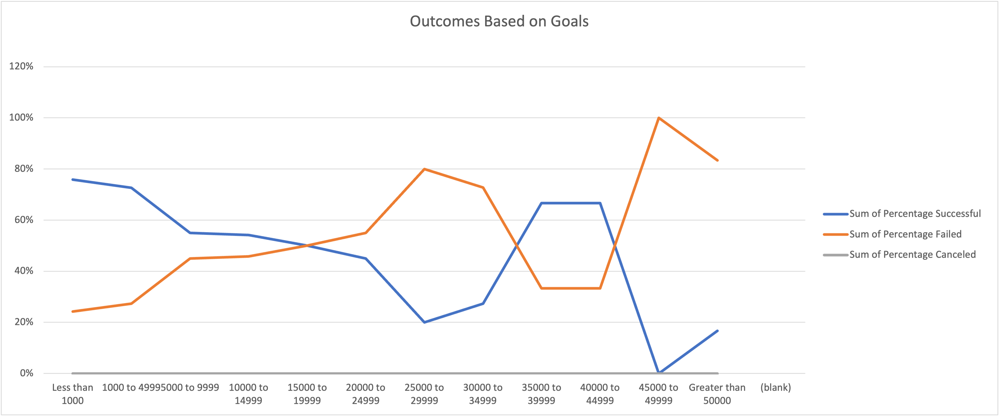

# An Analysis of Kickstarter Campaigns
## Purpose of analysis
### The purpose of this analysis is to find theater outcomes based on launch date and play outcomes based on goal 

## Analysis and Challenges
### I performed my analysis by using Pivot Tables and Pivot Charts.This tools allowed me to organize and visualize data we needed to analyze. 

## Overview 
- What are two conclusions you can draw about the Outcomes based on Launch Date?
### The most successful month to launch a theater is May.The least successful month to launch theater is December. 
- What can you conclude about the Outcomes based on Goals?
### There are only two projects with goal greater than $50000

- What are some limitations of this dataset?
### I don’t see any particular limitations of this dataset 

- What are some other possible tables and/or graphs that we could create?
### We could create a pivot table and pivot chart for television	subcategory based on launch date 

## Analysis of Outcomes Based on Launch Date

## Analysis of Outcomes Based on Goals

### Challenges and Difficulties Encountered

